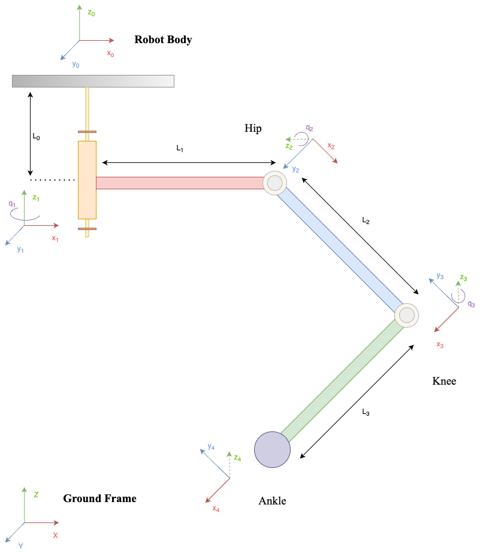
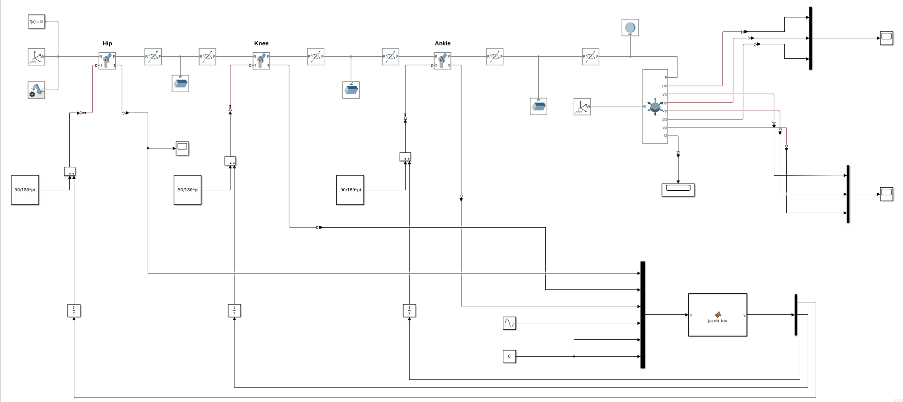
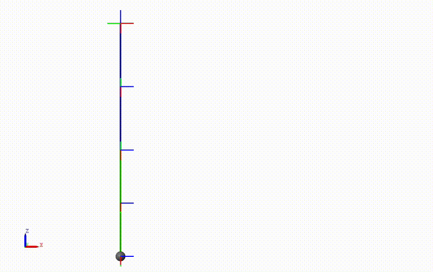
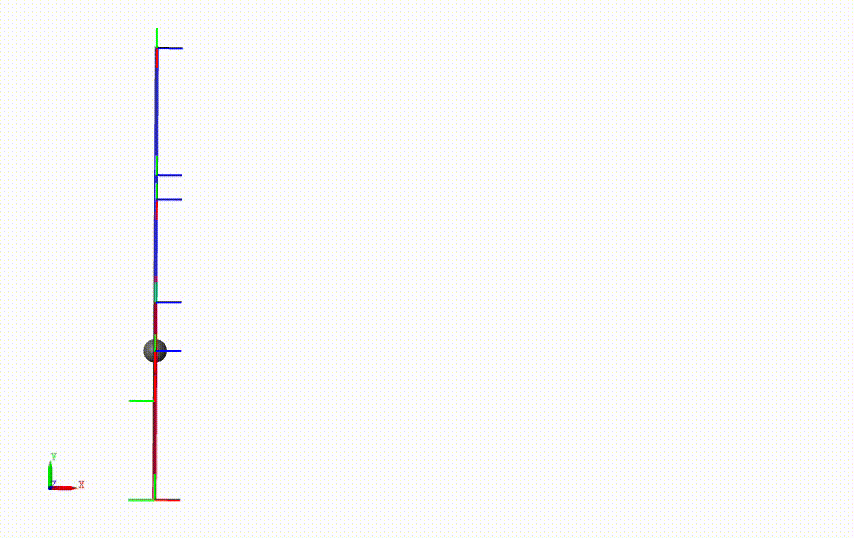

# Geometric and kinematic modeling of Hexapod Leg

The objective of this project to control forward kinamatic motion of Hexapod leg. The deliveribles of the project is the simulation of the hexapod leg in forward direction. Along with it theoritical solution (Forward Kinamatics) of SCARA robot and double pendulum also been calcualted as a pat of the assignemnt. 

Subcomponents of the problem involve:

1. Determining the desired controlled degrees of freedom (DOF) of the foot.
2. Computing the Denavit-Hartenberg (DH) or Khalil formalism for the Hexapod.
3. Evaluating the Jacobian matrix.
4. Implementing the simulation of the Hexabot leg using MATLAB.

Group Members:

[Abhimanyu Bhowmik](https://github.com/abhimanyubhowmik) & [Madhushree Sannigrahi](https://github.com/Madhushree2000)

The Hexapod Leg

## Solution

 According to our reference frame, we can write the other frames with respect to Displacement and Rotation along the X and Z axis of each frame. Which is the DH parameters of the Hexabot Leg described in the table:

| Frame No. | Dist. along X (d) | Angle along X (α) | Dist. along Z (r) | Angle along Z (θ) |
|-----------|--------------------|-------------------|-------------------|-------------------|
| 1         | 0                  | 0                 | L0                | q1                |
| 2         | L1                 | π /2              | 0                 | q2                |
| 3         | L2                 | 0                 | 0                 | q3                |
| 4         | L3                 | 0                 | 0                 | 0                 |

Finally we can use Homogeneous Transformation Matrices to find the Jacobian of this hexapod leg. 

$$J = \begin{bmatrix}
-L3s_1c_{23} - L1s_1 - L2c_2s_1& - L3c_1s_{23} - L2c_1s_2& -L3c_1s_{23}\\
L3c_1c_{23} + L1c_1 + L2c_1c_2& - L3s_1s_{23} - L2s_1s_2& -L3s_1s_{23}\\
 0& L3c_{23} + L2c_2&                 L3c_{23} \\
\end{bmatrix} $$

From the Jacobian matrix we got, we can easily derive the singularities of the Hexabot Leg. By finding the roots of the equation:

$$Det(J) = 0$$

Here, the determinant |J| = 0 when the values of $qi = 0$ or $\pi$ where i = 1,2,3. This means that these angles lead to singularity or loss of 1 DOF.

## Simulation

To study the solution, we have modelled the system using Matlab's Simscape Multibody toolbox. The model is shown in the figure:

Matlab Simulator

To provide the model with only a forward step we need to provide the leg with only x-direction movement. Here in this model, we have given a sinusoidal signal with amplitude 50 and frequency 1 rad/sec. The simulation esults are shown here:

<table>
  <tr>
    <td width="50%">  (a) </td>
    <td width="50%">  (b) </td>
  </tr>
</table>

(a) Front View ,(b) Top View of Hexapod Leg

